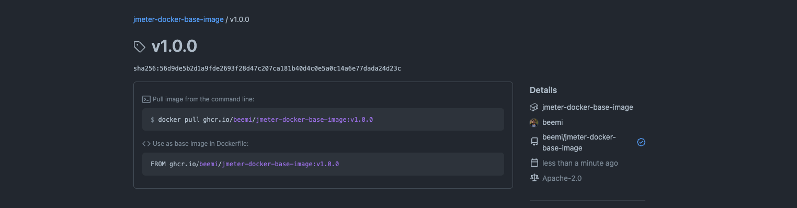

JMeter Docker base image
================================

This repository contains JMeter installation along with extra plugins.

Package Details: [JMeter Base Docker Image](https://github.com/beemi/jmeter-docker-base-image/pkgs/container/jmeter-docker-base-image)

# How to publish the image

```
git tag v1.0.0
```

```
git push origin v1.0.0
```



## :postbox: Contacts
 
Owner: [beemi.raja@gmail.com](beemi.raja@gmail.com)
